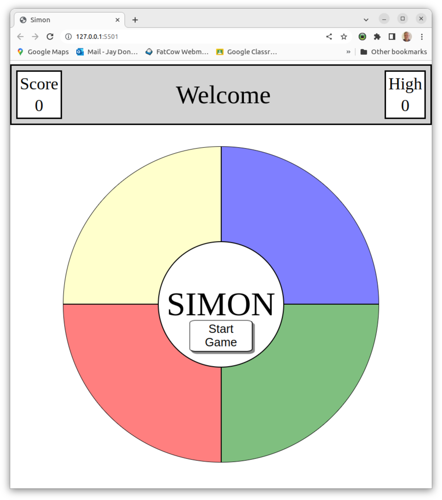

# Simon Game

Simon is an electronic game of short-term memory skill invented by Ralph H. Baer and Howard J. Morrison, working for toy design firm Marvin Glass and Associates, with software programming by Lenny Cope. The device creates a series of tones and lights and requires a user to repeat the sequence. If the user succeeds, the series becomes progressively longer and more complex.

## Screenshot:

## Technologies Used:

* HTML5
* CSS3 - including flex grid
* Javascript

## Getting Started:

Click [this link](https://wjdonaldson.github.io/simon/) to load the game. Press the 'Start Game' button in the middle of the game board to begin, then repeat the sequence on your turn.

## Next Steps:
* Add a timeout for the user to repeat back the sequence.
* Get rid of the audible 'pops' when a tone finishes playing.
* Make configuration setting for difficulty level that affects the speed at which the sequence plays.

